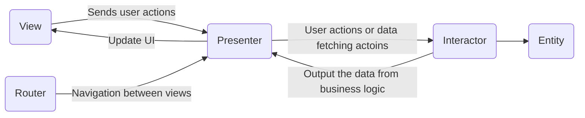

# Swift-VIPER

This is a example for **VIPER** design pattern in Swift 4.

## VIPER 

- V :  View
	-  Send user actions to the presenter and then show whatever the presenter fetched.
- I :  Interactor
	-  Create use case to handle the business logic.
- P : Presenter
	- Provide the view logic for preparing datas for display, and  reacting to user actions.
- E :  Entity
	- The basic model for objects.
- R :  Router
	- Provide logic for routing views.